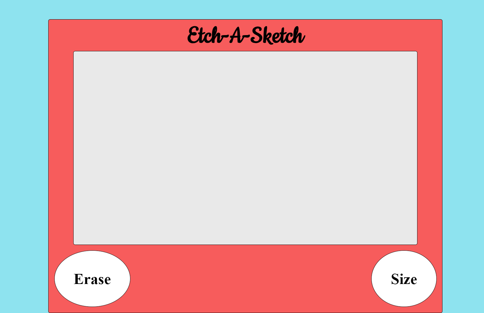

# Etch-a-Sketch

This project is an Etch-a-Sketch game developed as part of The Odin Project curriculum to practice DOM manipulation. The game allows users to draw on a grid by hovering their mouse over the cells. Users can also customize the size of the grid and erase their drawing.

## Live Demo

[Click here to try the Etch-a-Sketch game!](https://peterg-ithub.github.io/etch-a-sketch/)

## Technologies Used

- HTML
- CSS
- JavaScript

## Features

- Users can draw on the grid by hovering their mouse over the cells.
- The size of the grid can be customized.
- Users can erase their drawing by clicking the "Erase" button.

## Screenshot

### Main Page
